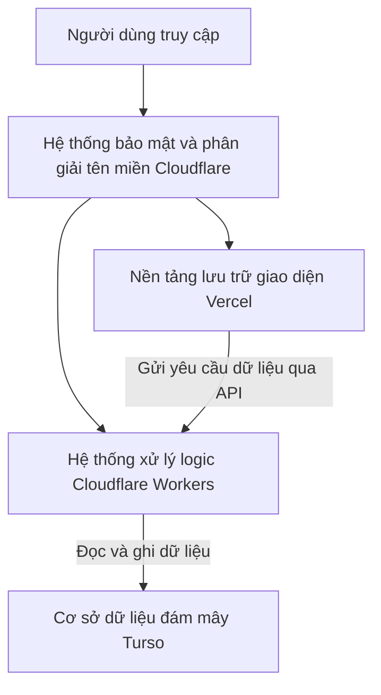

# Dấu Ấn Văn Học - Tài liệu Kỹ thuật & Công nghệ Hệ thống

Tài liệu này cung cấp thông tin chi tiết, toàn diện và dễ hiểu về kiến trúc hệ thống, các công nghệ cốt lõi và giải pháp bảo mật được áp dụng để xây dựng và vận hành trang web **Dấu Ấn Văn Học** (hoạt động trên các tên miền dauanvanhoc.site và dauanvanhot.site).

---

## 1. Giải thích về Kiến trúc Hệ thống (Mô hình tách biệt Frontend và Backend)

Dự án này được xây dựng dựa trên kiến trúc **Jamstack** (viết tắt của JavaScript, APIs và Markup). Đây là một phương pháp thiết kế web hiện đại giúp tối ưu hóa hiệu năng và độ an toàn bằng cách tách rời hoàn toàn phần giao diện hiển thị và phần xử lý dữ liệu:

* **Phần giao diện hiển thị (Frontend - Markup & JavaScript):** Toàn bộ giao diện người dùng được biên dịch thành các tệp tin tĩnh (HTML, CSS và JavaScript thuần) ngay từ lúc đóng gói ứng dụng. Khi người dùng truy cập, các tệp tin này được tải trực tiếp từ máy chủ phân phối mà không cần máy chủ phải xử lý hay tạo lại trang từ đầu. Điều này giúp trang web hiển thị gần như lập tức.
* **Phần xử lý nghiệp vụ (Backend - APIs):** Các tính năng động như đăng nhập, lưu bài viết, bình luận hoặc truy vấn cơ sở dữ liệu sẽ không chạy trên cùng một máy chủ với giao diện. Thay vào đó, chúng được tách thành các dịch vụ độc lập và giao tiếp với giao diện thông qua các cổng kết nối lập trình (API).

### Sơ đồ luồng hoạt động của hệ thống:

---

## 2. Chi tiết về các Công nghệ Sử dụng

### 2.1. Ngôn ngữ chính: JavaScript
Toàn bộ mã nguồn của cả phần giao diện (Frontend) lẫn phần xử lý (Backend) đều sử dụng **JavaScript**:
* **Tính đồng nhất:** Việc sử dụng một ngôn ngữ duy nhất giúp việc phát triển trở nên nhanh chóng, dễ dàng chuyển đổi hoặc chia sẻ cấu trúc dữ liệu giữa giao diện và máy chủ.
* **Xử lý bất đồng bộ:** Tận dụng khả năng xử lý nhiều yêu cầu cùng lúc mà không gây nghẽn hệ thống, giúp ứng dụng phản hồi nhanh chóng ngay cả khi có nhiều người dùng truy cập đồng thời.

### 2.2. Khung phát triển giao diện: Svelte (SvelteKit)
Giao diện của trang web được xây dựng bằng công nghệ **Svelte**:
* **Cơ chế biên dịch tối ưu:** Khác với các thư viện phổ biến khác phải chạy một hệ thống giám sát giao diện ảo ngay trên trình duyệt của người dùng (gây nặng máy), Svelte tự động biên dịch mã nguồn thành JavaScript siêu nhẹ và tối giản trước khi tải lên mạng. Nhờ đó, trình duyệt không phải xử lý thừa, giúp tốc độ tải trang đạt mức tối đa.
* **Tương tác mượt mà:** Svelte hoạt động như một ứng dụng chạy trực tiếp trên trình duyệt. Khi người dùng chuyển trang hoặc bấm nút, chỉ các phần dữ liệu thay đổi được cập nhật mà không cần tải lại toàn bộ trang web.
* **Trình bày giao diện:** Kết hợp với công nghệ Tailwind CSS để thiết kế giao diện thích ứng tốt trên cả máy tính lẫn điện thoại di động.

### 2.3. Hệ thống xử lý dữ liệu không máy chủ: Cloudflare Workers
Toàn bộ mã nguồn xử lý logic (Backend) và các đường dẫn kết nối (API) được vận hành trên **Cloudflare Workers**:
* **Không cần quản lý máy chủ vật lý:** Đây là công nghệ chạy mã nguồn trực tiếp trên mạng lưới máy chủ toàn cầu của Cloudflare. Hệ thống tự động phân phối và chạy mã nguồn tại máy chủ gần vị trí địa lý của người dùng nhất, giúp giảm thiểu thời gian chờ đợi.
* **Tự động co giãn:** Hệ thống tự động tăng công suất xử lý khi lượng truy cập tăng đột biến và giảm xuống khi ít người dùng, giúp tối ưu chi phí vận hành và không bao giờ bị quá tải.

### 2.4. Cơ sở dữ liệu đám mây: Turso (libSQL)
Hệ thống lưu trữ thông tin bài viết, người dùng và dữ liệu hệ thống trên cơ sở dữ liệu **Turso**:
* **Công nghệ libSQL:** Đây là phiên bản nâng cấp chuyên dụng của SQLite, được tối ưu riêng cho các môi trường chạy trên mạng lưới phân tán như Cloudflare Workers.
* **Truy cập tốc độ cao:** Dữ liệu được đặt cực kỳ gần với nơi xử lý mã nguồn của Cloudflare Workers, giúp các thao tác đọc và ghi dữ liệu diễn ra gần như ngay lập tức.
* **Quản lý cấu trúc dữ liệu:** Sử dụng các công cụ Drizzle ORM và Kysely để đảm bảo các câu lệnh truy vấn dữ liệu chính xác, an toàn và dễ bảo trì.

### 2.5. Hệ thống xác thực và đăng nhập: Better Auth
Để bảo vệ tài khoản người dùng và quản lý phiên làm việc, dự án sử dụng **Better Auth**:
* **Bảo mật cao:** Được thiết kế tối ưu để chạy trên môi trường Cloudflare Workers, giúp xác thực thông tin đăng nhập của người dùng cực kỳ nhanh chóng.
* **Chống tấn công:** Tích hợp sẵn các giải pháp chống giả mạo yêu cầu (CSRF) và bảo vệ an toàn cho các mã khóa phiên làm việc (Session Tokens) lưu trên trình duyệt của người dùng.

### 2.6. Nền tảng lưu trữ và tự động hóa: Vercel
Giao diện Svelte sau khi được đóng gói sẽ được đưa lên lưu trữ tại **Vercel**:
* **Tự động cập nhật:** Mỗi khi nhà phát triển cập nhật mã nguồn mới lên hệ thống quản lý phiên bản Git, Vercel sẽ tự động kiểm tra, biên dịch và cập nhật phiên bản mới lên trang web mà không gây gián đoạn dịch vụ.
* **Phân phối nhanh:** Tự động tối ưu hóa và đưa các tệp tin giao diện đến mạng lưới máy chủ lưu trữ toàn cầu để người dùng tải về nhanh nhất.

### 2.7. Lá chắn bảo mật và quản lý tên miền: Cloudflare
Mọi lưu lượng truy cập vào hệ thống đều phải đi qua lớp bảo vệ của **Cloudflare**:
* **Quản lý tên miền:** Phân giải địa chỉ trang web nhanh chóng và chính xác cho các tên miền `dauanvanhoc.site` và `dauanvanhot.site`.
* **Chống tấn công từ chối dịch vụ (DDoS):** Tự động phát hiện và ngăn chặn các nguồn truy cập ảo quy mô lớn nhằm làm sập trang web.
* **Lọc thư rác và tài khoản ảo (Anti-spam):** Áp dụng các bộ lọc tường lửa ứng dụng (WAF) và công nghệ Turnstile để xác minh người dùng thật, chặn đứng các phần mềm tự động (bot) phá hoại hoặc spam nội dung.

---

## 3. Quy trình vận hành và cập nhật (Workflow)

1. **Cập nhật giao diện:** Người phát triển thay đổi mã nguồn giao diện -> Hệ thống Vercel tự động nhận biết, biên dịch thành các tệp tối giản và đưa lên môi trường trực tuyến.
2. **Cập nhật tính năng:** Thay đổi mã nguồn xử lý backend -> Dùng công cụ Wrangler để tải mã nguồn mới lên hệ thống Cloudflare Workers toàn cầu.
3. **Cập nhật cơ sở dữ liệu:** Cấu trúc bảng dữ liệu thay đổi -> Chạy lệnh đồng bộ từ máy tính cá nhân để cập nhật trực tiếp cấu trúc mới lên máy chủ cơ sở dữ liệu Turso.
