# Chương 5. Nội dung thực hiện

---

## Mục lục

- [5.1 Quá trình thực hiện giải pháp](#51-quá-trình-thực-hiện-giải-pháp)
  - [5.1.1 Khảo sát và phân tích bài toán](#511-khảo-sát-và-phân-tích-bài-toán)
  - [5.1.2 Lập kế hoạch thực hiện](#512-lập-kế-hoạch-thực-hiện)
  - [5.1.3 Lựa chọn công nghệ và công cụ](#513-lựa-chọn-công-nghệ-và-công-cụ)
- [5.2 Thiết kế và xây dựng hệ thống](#52-thiết-kế-và-xây-dựng-hệ-thống)
  - [5.2.1 Thiết kế hệ thống](#521-thiết-kế-hệ-thống)
  - [5.2.2 Tính toán kỹ thuật](#522-tính-toán-kỹ-thuật)
- [5.3 Thử nghiệm thực tế](#53-thử-nghiệm-thực-tế)
  - [5.3.1 Môi trường thử nghiệm](#531-môi-trường-thử-nghiệm)
  - [5.3.2 Quy trình thử nghiệm](#532-quy-trình-thử-nghiệm)
  - [5.3.3 Kết quả thử nghiệm](#533-kết-quả-thử-nghiệm)
- [5.4 Triển khai và hoàn thiện sản phẩm](#54-triển-khai-và-hoàn-thiện-sản-phẩm)
  - [5.4.1 Quy trình triển khai](#541-quy-trình-triển-khai)
  - [5.4.2 Sản phẩm hoàn thiện](#542-sản-phẩm-hoàn-thiện)
- [5.5 Đánh giá mức độ hoàn thành giải pháp](#55-đánh-giá-mức-độ-hoàn-thành-giải-pháp)
  - [5.5.1 Mức độ hoàn thành](#551-mức-độ-hoàn-thành)
  - [5.5.2 Đánh giá chất lượng](#552-đánh-giá-chất-lượng)
  - [5.5.3 Ưu điểm và hạn chế](#553-ưu-điểm-và-hạn-chế)
  - [5.5.4 Hướng phát triển](#554-hướng-phát-triển)

---

## 5.1 Quá trình thực hiện giải pháp

Chương này trình bày toàn bộ quá trình triển khai dự án **Thư viện Văn học Số Lâm Đồng (VHDP — Văn Học Địa Phương)**, bao gồm các bước từ khảo sát thực trạng, lập kế hoạch, lựa chọn công nghệ đến thiết kế, xây dựng, thử nghiệm và đưa vào vận hành. Dự án được thực hiện trong bối cảnh nhu cầu số hóa và bảo tồn di sản văn học địa phương tỉnh Lâm Đồng ngày càng trở nên cấp thiết, trong khi chưa có một nền tảng kỹ thuật số toàn diện nào đáp ứng được đầy đủ yêu cầu này. Toàn bộ quy trình thực hiện được kiểm soát chặt chẽ theo phương pháp phát triển phần mềm hiện đại, đảm bảo sản phẩm cuối cùng đạt chuẩn về chất lượng kỹ thuật lẫn giá trị ứng dụng thực tiễn.

---

### 5.1.1 Khảo sát và phân tích bài toán

#### Bối cảnh và thực trạng

Tỉnh Lâm Đồng sở hữu kho tàng văn học dân gian và đương đại phong phú, bao gồm các tác phẩm thơ văn, truyện ngắn, truyện dài, truyện tranh, tác phẩm âm nhạc và các thước phim tài liệu về văn hóa địa phương. Tuy nhiên, hầu hết các tác phẩm này chưa được số hóa, phân loại hệ thống và tiếp cận rộng rãi đến công chúng. Người dân, đặc biệt là thế hệ trẻ, gặp nhiều khó khăn trong việc tìm kiếm và tiếp cận di sản văn học của tỉnh nhà. Bên cạnh đó, các tác giả địa phương thiếu một nền tảng chuyên biệt để xuất bản và quảng bá tác phẩm của mình.

Từ thực trạng đó, nhóm tiến hành khảo sát nhu cầu thực tế thông qua phỏng vấn trực tiếp với đại diện Sở Văn hóa, Thể thao và Du lịch tỉnh Lâm Đồng, các thư viện tỉnh, trường học và một số tác giả văn học địa phương. Kết quả khảo sát cho thấy nhu cầu cần một hệ thống thư viện số tích hợp đa phương tiện, có khả năng lưu trữ và phân phối nội dung đa dạng gồm văn bản, hình ảnh, âm thanh và video.

#### Phân tích yêu cầu

Dựa trên kết quả khảo sát, nhóm tổng hợp và phân loại yêu cầu thành hai nhóm chính: yêu cầu chức năng và yêu cầu phi chức năng.

**Yêu cầu chức năng:**

| STT | Nhóm chức năng | Mô tả chi tiết |
|-----|----------------|----------------|
| 1 | Quản lý tác phẩm | Thêm, sửa, xóa, phân loại truyện chữ, truyện tranh, audio, video |
| 2 | Đọc/Nghe/Xem trực tuyến | Trình đọc văn bản, trình xem truyện tranh, trình phát audio và video |
| 3 | Xác thực người dùng | Đăng ký, đăng nhập bằng email và mật khẩu, quản lý phiên |
| 4 | Thư viện cá nhân | Đánh dấu, lưu tác phẩm yêu thích, theo dõi tiến trình đọc |
| 5 | Đánh giá và nhận xét | Chấm điểm (1–5 sao), viết bình luận cho từng tác phẩm |
| 6 | Diễn đàn cộng đồng | Đăng bài, trả lời, thả tim bài viết, chia sẻ hình ảnh |
| 7 | Tìm kiếm | Tìm kiếm toàn văn theo tên tác phẩm, tác giả, thể loại |
| 8 | Bản đồ văn học | Hiển thị bản đồ địa lý tỉnh Lâm Đồng gắn với các tác phẩm |
| 9 | Quản trị hệ thống | Dashboard admin quản lý người dùng, nội dung, thống kê |
| 10 | Tải lên phương tiện | Upload ảnh bìa, file âm thanh, file video cho tác phẩm |

**Yêu cầu phi chức năng:**

| STT | Yêu cầu | Chỉ tiêu |
|-----|---------|---------|
| 1 | Hiệu năng | Thời gian phản hồi API < 500ms với 95% request |
| 2 | Khả dụng | Uptime ≥ 99.5% |
| 3 | Bảo mật | Xác thực phiên an toàn, phân quyền rõ ràng (user/admin) |
| 4 | Khả năng mở rộng | Kiến trúc serverless, scale tự động khi lưu lượng tăng |
| 5 | Tương thích | Hoạt động trên trình duyệt hiện đại, hỗ trợ mobile và desktop |
| 6 | Khả năng bảo trì | Codebase có cấu trúc rõ ràng, phân tách frontend/backend |

#### Phạm vi dự án

Dự án VHDP tập trung vào việc xây dựng một nền tảng web hoàn chỉnh phục vụ cho việc số hóa và lưu trữ các tác phẩm văn học địa phương tỉnh Lâm Đồng. Phạm vi bao gồm toàn bộ vòng đời của nội dung số: từ khâu nhập liệu bởi quản trị viên, đến lưu trữ trên đám mây, phân phối đến người dùng cuối thông qua giao diện web, và tương tác cộng đồng thông qua diễn đàn và hệ thống đánh giá.

Các chức năng nằm ngoài phạm vi hiện tại bao gồm: ứng dụng di động native, hệ thống thanh toán, tích hợp mạng xã hội bên ngoài, và hệ thống gợi ý thông minh dựa trên học máy.

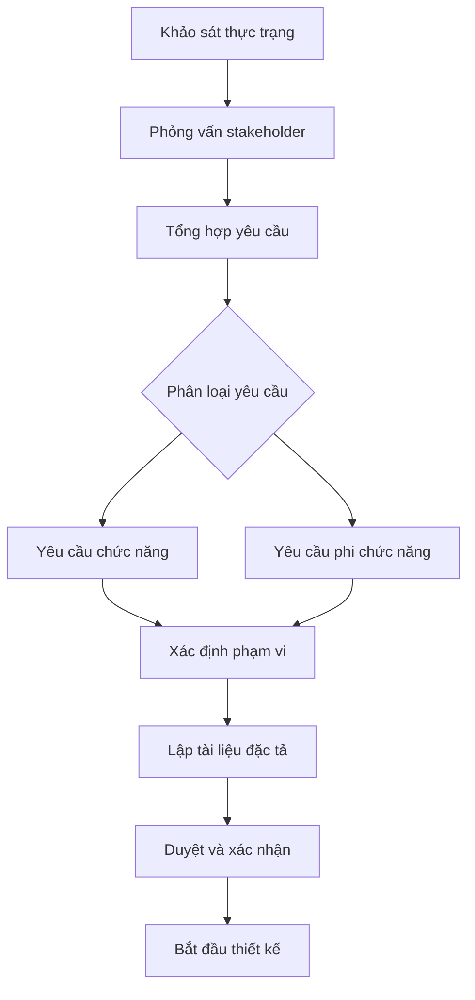

*Hình 5.1: Quy trình khảo sát và phân tích bài toán*

---

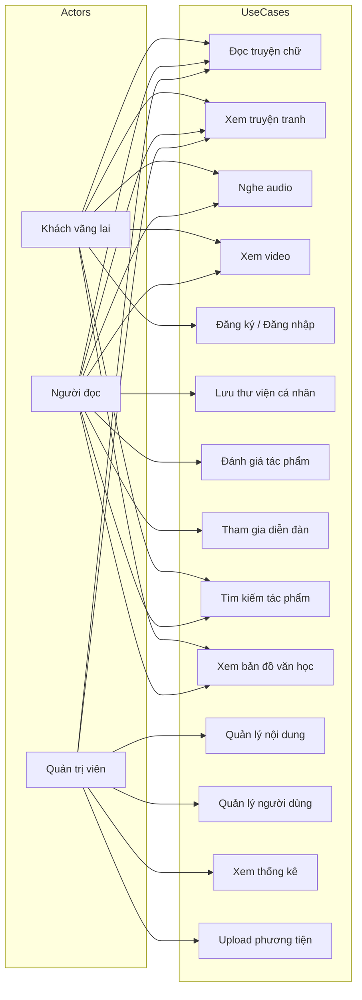

*Hình 5.2: Sơ đồ Use Case tổng quan hệ thống VHDP*

---

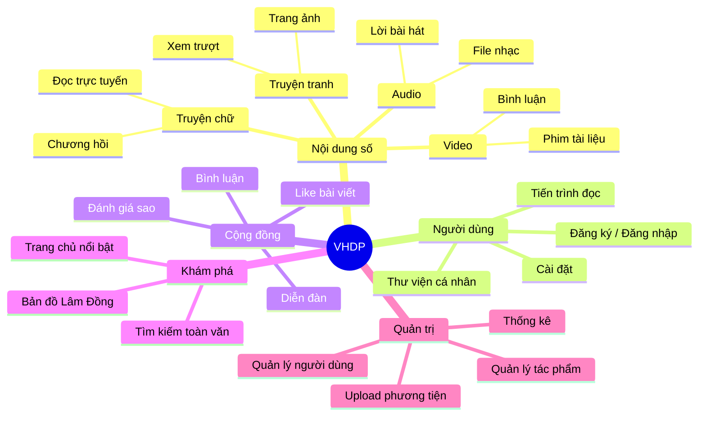

*Hình 5.3: Mindmap yêu cầu hệ thống*

---

### 5.1.2 Lập kế hoạch thực hiện

#### Tổng quan kế hoạch

Dự án được tổ chức theo mô hình phát triển lặp (iterative), chia thành 4 giai đoạn chính với tổng thời gian thực hiện khoảng 12 tuần (từ tháng 4 đến tháng 7 năm 2026). Mô hình này cho phép nhóm linh hoạt điều chỉnh yêu cầu trong quá trình phát triển, đồng thời đảm bảo sản phẩm luôn có một phiên bản chạy được để kiểm thử liên tục.

#### Phân chia giai đoạn

| Giai đoạn | Tên | Thời gian | Mục tiêu |
|-----------|-----|-----------|---------|
| 1 | Phân tích & Thiết kế | Tuần 1–2 | Đặc tả yêu cầu, thiết kế DB, thiết kế UI mockup |
| 2 | Xây dựng core | Tuần 3–6 | Backend API, xác thực người dùng, CRUD tác phẩm |
| 3 | Phát triển tính năng | Tuần 7–10 | Đọc/nghe/xem, diễn đàn, thư viện, bản đồ, admin |
| 4 | Kiểm thử & Triển khai | Tuần 11–12 | Test toàn diện, fix bug, deploy production |

#### Phân chia module

Hệ thống được phân chia thành các module độc lập theo nguyên tắc Separation of Concerns, đảm bảo mỗi module có trách nhiệm rõ ràng và có thể phát triển song song.

| Module | Thuộc phần | Chức năng chính |
|--------|-----------|----------------|
| Auth Module | Backend | Đăng ký, đăng nhập, quản lý phiên, phân quyền |
| Books Module | Backend | CRUD sách, chapter, bookmark, rating |
| Media Module | Backend | CRUD audio, video, upload file, streaming |
| Forum Module | Backend | CRUD threads, likes, replies |
| Library Module | Backend | Quản lý thư viện cá nhân người dùng |
| Admin Module | Backend | Thống kê, quản lý user, quản lý nội dung |
| Home Page | Frontend | Trang chủ, giới thiệu, hiển thị nổi bật |
| Reader Module | Frontend | Giao diện đọc truyện chữ và xem truyện tranh |
| Player Module | Frontend | Trình phát audio, video tích hợp Plyr.js |
| Forum UI | Frontend | Giao diện diễn đàn, đăng bài, bình luận |
| Library UI | Frontend | Giao diện thư viện cá nhân |
| Admin Dashboard | Frontend | Bảng điều khiển quản trị |
| Map Component | Frontend | Bản đồ Lâm Đồng tương tác với Leaflet.js |
| Search Modal | Frontend | Tìm kiếm toàn văn real-time |

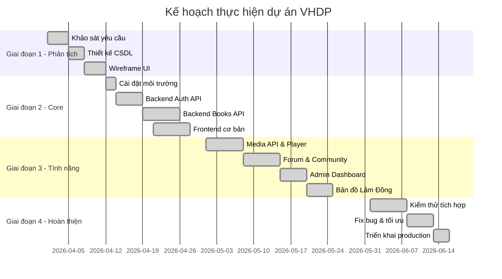

*Hình 5.4: Gantt Chart kế hoạch thực hiện dự án*

---

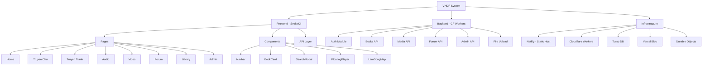

*Hình 5.5: Work Breakdown Structure (WBS) dự án VHDP*

---

### 5.1.3 Lựa chọn công nghệ và công cụ

#### Tổng quan stack công nghệ

Việc lựa chọn công nghệ được thực hiện dựa trên ba tiêu chí chính: (1) phù hợp với quy mô và đặc thù của dự án, (2) khả năng scale và chi phí vận hành thấp, và (3) hệ sinh thái phát triển tốt với tài liệu đầy đủ. Nhóm ưu tiên các công nghệ thuộc hệ sinh thái serverless và edge computing nhằm đảm bảo hiệu năng cao với chi phí tối ưu, phù hợp với bối cảnh dự án học thuật không có ngân sách vận hành lớn.

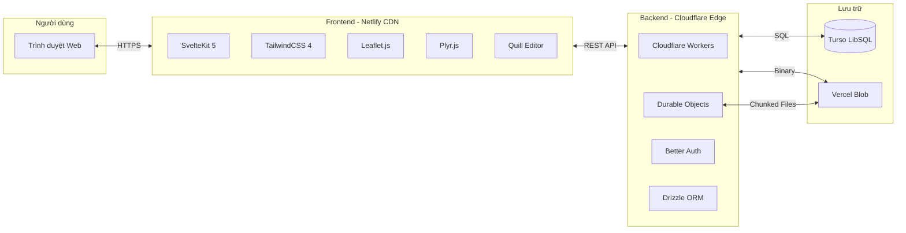

*Hình 5.6: Sơ đồ kiến trúc stack công nghệ tổng quan*

---

#### Bảng chi tiết công nghệ sử dụng

**Ngôn ngữ lập trình và Runtime:**

| Công nghệ | Phiên bản | Vai trò | Lý do lựa chọn | Ưu điểm | Nhược điểm |
|-----------|-----------|---------|----------------|---------|------------|
| JavaScript (ES Modules) | ES2022+ | Ngôn ngữ lập trình chính cho cả frontend và backend | Không cần build step phức tạp, tận dụng được tối đa hệ sinh thái npm | Phổ biến, cộng đồng lớn, chạy native trên Cloudflare Workers | Thiếu type safety so với TypeScript |
| Node.js (tương thích) | compat flag | Runtime backend trên CF Workers | CF Workers hỗ trợ Node.js compat layer | Tái sử dụng thư viện Node.js | Không phải Node.js thực sự, một số API bị giới hạn |

**Framework Frontend:**

| Công nghệ | Phiên bản | Vai trò | Lý do lựa chọn | Ưu điểm | Nhược điểm |
|-----------|-----------|---------|----------------|---------|------------|
| SvelteKit | 2.57 | Full-stack web framework | Svelte 5 Runes cho reactive UI hiệu quả, adapter-static xuất file tĩnh | Bundle size nhỏ, không Virtual DOM, hiệu năng cao | Hệ sinh thái nhỏ hơn React/Vue |
| Svelte | 5.55 | UI component library | Reactivity model mới (Runes) trực quan, ít boilerplate | Compile-time framework, zero runtime overhead | Đang trong giai đoạn chuyển đổi từ v4 sang v5 |
| TailwindCSS | 4.2 | Utility-first CSS | Tích hợp sẵn với SvelteKit, DX tốt | Nhanh, nhất quán, không cần đặt tên class | Có thể làm HTML dài |
| mdsvex | 0.12 | Markdown processor cho Svelte | Cho phép render nội dung Markdown trong component Svelte | Hỗ trợ frontmatter, linh hoạt | Ít phổ biến |

**Backend và API:**

| Công nghệ | Phiên bản | Vai trò | Lý do lựa chọn | Ưu điểm | Nhược điểm |
|-----------|-----------|---------|----------------|---------|------------|
| Cloudflare Workers | — | Serverless API runtime | Edge computing, zero cold start, miễn phí 100k req/ngày | Cực nhanh (< 50ms cold start), global network | Giới hạn CPU 10ms/request (plan miễn phí) |
| Cloudflare Durable Objects | — | Lưu trữ file chunked (fallback) | Stateful storage tích hợp sẵn trong CF ecosystem | ACID transactions, strongly consistent | Giá thành khi scale lớn |
| Better Auth | 1.6 | Xác thực người dùng | Thư viện auth hiện đại, hỗ trợ Drizzle adapter sẵn | Session-based, tích hợp plugin bearer token | Tài liệu còn đang phát triển |
| Drizzle ORM | 0.45 | Object-Relational Mapper | Type-safe SQL queries, hỗ trợ LibSQL/Turso | Lightweight, không magic, dễ debug | Ít tính năng hơn Prisma |

**Cơ sở dữ liệu:**

| Công nghệ | Phiên bản | Vai trò | Lý do lựa chọn | Ưu điểm | Nhược điểm |
|-----------|-----------|---------|----------------|---------|------------|
| Turso (LibSQL) | — | Cơ sở dữ liệu chính | SQLite-compatible, triển khai trên edge gần Cloudflare Workers | Latency thấp, free tier 9GB storage, replica toàn cầu | Không hỗ trợ stored procedures phức tạp |

**Lưu trữ phương tiện:**

| Công nghệ | Phiên bản | Vai trò | Lý do lựa chọn | Ưu điểm | Nhược điểm |
|-----------|-----------|---------|----------------|---------|------------|
| Vercel Blob | 2.4 | Lưu trữ file binary (ảnh, audio, video) | Free tier 1GB, tốc độ CDN toàn cầu | Private blob, streaming support, SDK đơn giản | Gắn với hệ sinh thái Vercel |

**Thư viện phía Client:**

| Công nghệ | Phiên bản | Vai trò | Lý do lựa chọn |
|-----------|-----------|---------|----------------|
| Leaflet.js | 1.9 | Bản đồ tương tác tỉnh Lâm Đồng | Nhẹ, mã nguồn mở, hỗ trợ GeoJSON tốt |
| Plyr.js | 3.8 | Trình phát audio/video | UI đẹp, hỗ trợ range request cho streaming |
| Quill.js | 2.0 | Rich text editor cho diễn đàn | Dễ tích hợp, hỗ trợ Delta format |
| Boxicons | 2.1 | Icon library | Đa dạng, nhẹ, dùng qua CDN |

**Công cụ phát triển:**

| Công cụ | Mục đích |
|---------|---------|
| Vite 8 | Build tool và dev server cực nhanh |
| pnpm | Package manager hiệu quả, tiết kiệm disk |
| Wrangler CLI | Deploy và phát triển Cloudflare Workers |
| VS Code | IDE chính với extension Svelte |
| Git + GitHub | Quản lý version control |

---

## 5.2 Thiết kế và xây dựng hệ thống

Sau khi hoàn tất giai đoạn phân tích và lập kế hoạch, nhóm tiến hành thiết kế kiến trúc tổng thể của hệ thống và xây dựng từng thành phần theo thứ tự ưu tiên. Phần này trình bày chi tiết các quyết định thiết kế quan trọng, bao gồm kiến trúc phần mềm, mô hình dữ liệu, thiết kế API và giao diện người dùng.

---

### 5.2.1 Thiết kế hệ thống

#### Kiến trúc tổng thể

Hệ thống VHDP được thiết kế theo mô hình **Jamstack** (JavaScript, APIs, Markup) kết hợp với kiến trúc **Edge Computing**. Theo đó, frontend được build thành các file tĩnh (HTML, CSS, JS) và phân phối qua CDN của Netlify, trong khi backend hoạt động dưới dạng các Cloudflare Workers chạy tại các edge node gần người dùng nhất trên toàn cầu. Sự phân tách rõ ràng này mang lại lợi thế về hiệu năng, bảo mật và khả năng mở rộng.

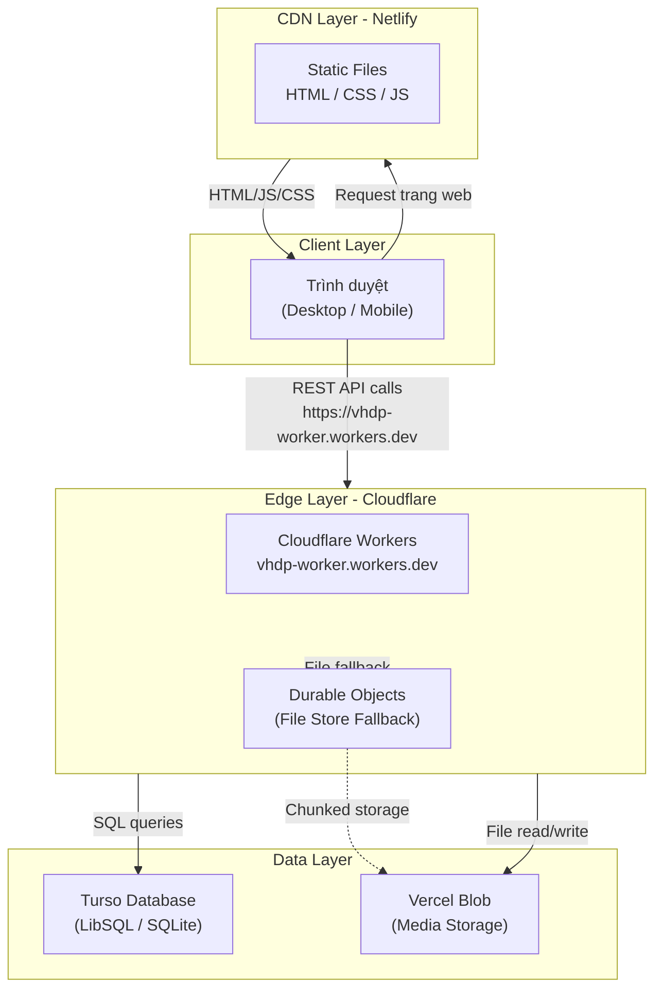

*Hình 5.7: Kiến trúc tổng thể hệ thống VHDP*

---

#### Thiết kế Module Backend

Backend được tổ chức dưới dạng một single Cloudflare Worker với routing thủ công theo pattern URL, không sử dụng framework router bên ngoài nhằm giảm thiểu dependency và tối ưu cold-start time. Mỗi nhóm route tương ứng với một module chức năng.

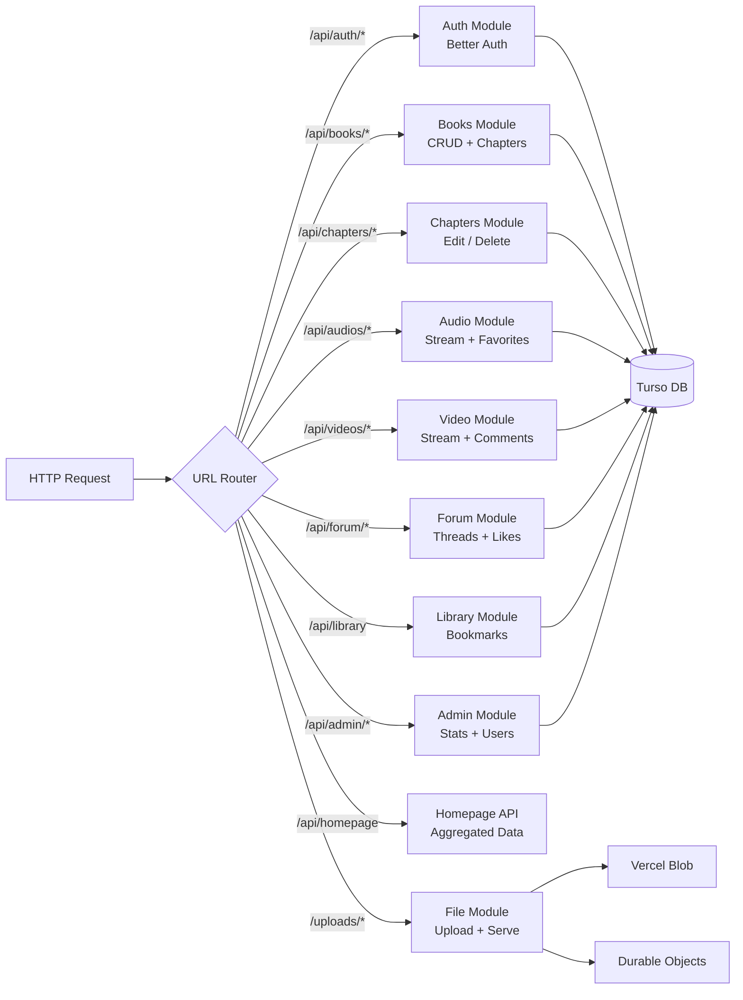

*Hình 5.8: Thiết kế module backend và luồng routing*

---

#### Thiết kế Cơ sở dữ liệu (ERD)

Hệ thống sử dụng SQLite thông qua Turso (LibSQL) với 13 bảng được thiết kế theo chuẩn hóa 3NF. Schema được khai báo bằng Drizzle ORM và khởi tạo tự động khi Worker khởi động lần đầu.

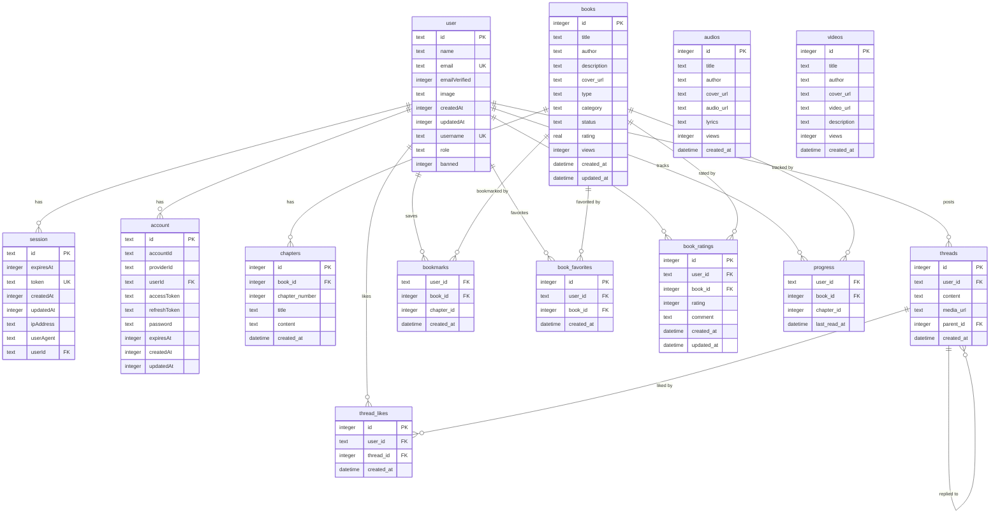

*Hình 5.9: Sơ đồ ERD cơ sở dữ liệu hệ thống VHDP*

---

#### Thiết kế API

Hệ thống API được thiết kế theo phong cách RESTful với các nguyên tắc nhất quán: sử dụng HTTP methods đúng ngữ nghĩa (GET, POST, PUT/PATCH, DELETE), trả về JSON cho mọi response, và áp dụng phân quyền role-based (user/admin) tại từng endpoint.

| Nhóm | Method | Endpoint | Mô tả | Xác thực |
|------|--------|----------|-------|---------|
| Auth | POST | /api/auth/sign-up/email | Đăng ký tài khoản | Không |
| Auth | POST | /api/auth/sign-in/email | Đăng nhập | Không |
| Auth | POST | /api/auth/sign-out | Đăng xuất | User |
| Auth | GET | /api/auth/get-session | Lấy thông tin phiên | Không |
| Books | GET | /api/books | Danh sách sách (phân trang) | Không |
| Books | POST | /api/books | Thêm sách mới | Admin |
| Books | GET | /api/books/:id | Chi tiết sách + chapters | Không |
| Books | PATCH | /api/books/:id | Sửa thông tin sách | Admin |
| Books | DELETE | /api/books/:id | Xóa sách | Admin |
| Chapters | POST | /api/books/:id/chapters | Thêm chương | Admin |
| Chapters | PUT | /api/chapters/:id | Sửa chương | Admin |
| Chapters | DELETE | /api/chapters/:id | Xóa chương | Admin |
| Bookmark | POST | /api/books/:id/toggle-bookmark | Thêm/xóa bookmark | User |
| Rating | POST | /api/books/:id/rate | Đánh giá sách | User |
| Rating | GET | /api/books/:id/ratings | Danh sách đánh giá | Không |
| Audio | GET | /api/audios | Danh sách audio | Không |
| Audio | POST | /api/audios | Thêm audio | Admin |
| Audio | GET | /api/audios/:id | Chi tiết audio | Không |
| Audio | PATCH | /api/audios/:id | Sửa audio | Admin |
| Audio | DELETE | /api/audios/:id | Xóa audio | Admin |
| Audio | POST | /api/audios/:id | Toggle yêu thích audio | User |
| Video | GET | /api/videos | Danh sách video | Không |
| Video | POST | /api/videos | Thêm video | Admin |
| Video | GET | /api/videos/:id | Chi tiết + video gợi ý | Không |
| Video | GET | /api/videos/:id/comments | Bình luận video | Không |
| Video | POST | /api/videos/:id/comments | Thêm bình luận | User |
| Forum | GET | /api/forum/posts | Danh sách bài viết | Không |
| Forum | POST | /api/forum/posts | Đăng bài viết | User |
| Forum | GET | /api/forum/posts/:id | Chi tiết bài + replies | Không |
| Forum | DELETE | /api/forum/posts/:id | Xóa bài viết | User/Admin |
| Forum | POST | /api/forum/posts/:id/like | Toggle like | User |
| Forum | POST | /api/forum/upload | Upload ảnh diễn đàn | User |
| Library | GET | /api/library | Thư viện cá nhân | User |
| Library | DELETE | /api/library | Xóa khỏi thư viện | User |
| Admin | GET | /api/admin/stats | Thống kê tổng quan | Admin |
| Admin | GET | /api/admin/users | Danh sách người dùng | Admin |
| Admin | POST | /api/admin/users/role | Đổi quyền user | Admin |
| Admin | POST | /api/admin/users/ban | Ban/unban user | Admin |
| File | GET | /uploads/:path | Phục vụ file media | Không |
| File | POST | /uploads/:path | Upload file | Admin |

#### Thiết kế Sequence Diagram — Luồng xác thực người dùng

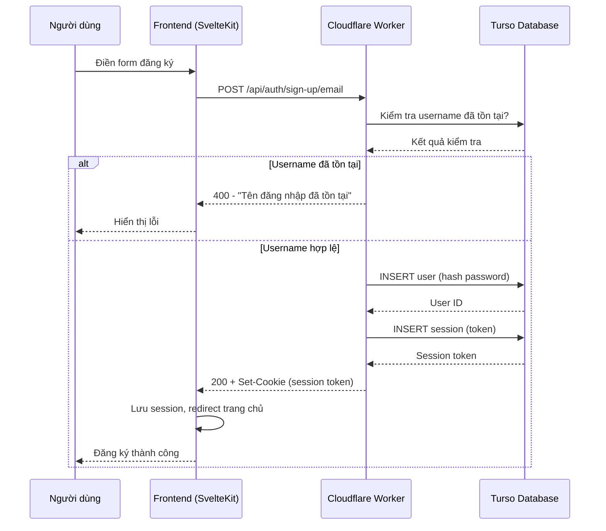

*Hình 5.10: Sequence Diagram luồng đăng ký tài khoản*

---

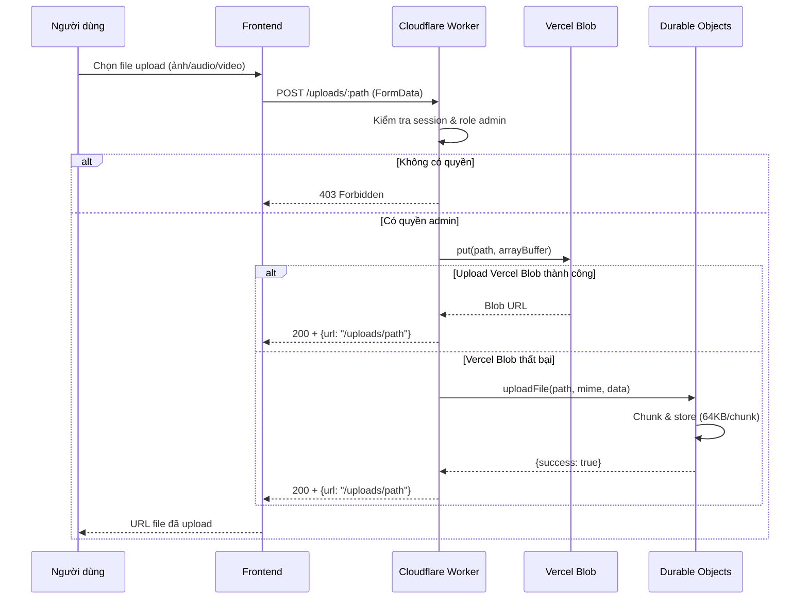

*Hình 5.11: Sequence Diagram luồng upload file phương tiện*

---

#### Thiết kế luồng dữ liệu — Đọc truyện chữ

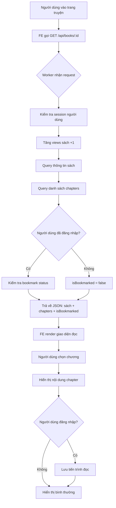

*Hình 5.12: Flowchart luồng đọc truyện chữ*

---

#### Thiết kế bảo mật

Hệ thống áp dụng nhiều lớp bảo mật để bảo vệ dữ liệu và quyền truy cập:

| Lớp bảo mật | Cơ chế | Chi tiết |
|-------------|--------|---------|
| Xác thực | Session token (HTTP-only cookie) | Better Auth tạo token ngẫu nhiên, lưu DB, kiểm tra mỗi request |
| Phân quyền | Role-based (user/admin) | Mọi route admin đều kiểm tra `role === "admin"` tại Worker |
| Chống CSRF | SameSite=None + Bearer token | Cookie SameSite=None, hỗ trợ Bearer token cho mobile |
| CORS | Whitelist origin | Chỉ cho phép dauanvanhoc.site và localhost trong development |
| Kiểm duyệt | Ban user | Admin có thể ban tài khoản, Worker reject mọi request từ user bị ban |
| Bảo vệ file | Upload chỉ cho admin | Endpoint `/uploads` POST yêu cầu role admin |
| Transport | HTTPS | Mọi kết nối đều qua HTTPS (CF + Netlify tự cấp SSL) |

---

### 5.2.2 Tính toán kỹ thuật

Để đảm bảo hệ thống hoạt động ổn định và đáp ứng được nhu cầu sử dụng thực tế, nhóm tiến hành ước tính các thông số kỹ thuật quan trọng liên quan đến hiệu năng, dung lượng lưu trữ, băng thông và chi phí triển khai.

#### Ước tính lưu lượng và dung lượng

| Thông số | Ước tính | Ghi chú |
|---------|---------|---------|
| Người dùng đồng thời (peak) | 50–100 | Phạm vi địa phương tỉnh Lâm Đồng |
| Request/ngày | ~5,000–10,000 | Nằm trong giới hạn free tier CF Workers |
| Kích thước trung bình 1 audio | 3–5 MB | File MP3 128kbps |
| Kích thước trung bình 1 video | 50–150 MB | MP4 720p |
| Kích thước trung bình 1 ảnh bìa | 50–200 KB | JPEG/WebP |
| Tổng dung lượng dự kiến (năm 1) | ~5–10 GB | Vercel Blob free tier: 1GB, scale theo nhu cầu |
| Dung lượng DB văn bản | ~100 MB | Turso free tier: 9GB |

#### Thông số hiệu năng Cloudflare Workers

| Thông số | Giá trị | Nguồn |
|---------|---------|-------|
| Cold start time | < 5ms | Cloudflare Edge Network |
| CPU time giới hạn (free) | 10ms/request | CF Workers Free Plan |
| Memory giới hạn | 128MB/request | CF Workers |
| Request timeout | 30 giây | CF default |
| Subrequest timeout | 30 giây | Fetch API |
| Bandwidth free | 10GB/tháng | CF Workers Free |

#### Ước tính thời gian phản hồi API

| Loại request | Thời gian ước tính | Ghi chú |
|-------------|-------------------|---------|
| GET /api/homepage | 80–150ms | 4 query DB song song |
| GET /api/books/:id | 50–100ms | 2 query + kiểm tra bookmark |
| GET /api/forum/posts | 60–120ms | 1 query phức tạp với subquery |
| POST /api/auth/sign-in | 100–200ms | Bcrypt hash verification |
| POST /api/books/:id/rate | 60–100ms | 2 query (upsert + avg) |
| POST /uploads/:path | 500–2000ms | Tùy kích thước file |

#### Ước tính chi phí triển khai

| Dịch vụ | Gói sử dụng | Chi phí/tháng | Ghi chú |
|---------|------------|--------------|---------|
| Cloudflare Workers | Free tier | $0 | 100k req/ngày |
| Cloudflare Durable Objects | Free tier | $0 | 1GB storage |
| Turso Database | Free tier | $0 | 500 DB, 9GB, 1B rows/tháng |
| Vercel Blob | Hobby tier | $0 | 1GB, sau đó $0.023/GB |
| Netlify Hosting | Free tier | $0 | 100GB bandwidth |
| Tên miền (dauanvanhoc.site) | Paid | ~$15/năm | ~$1.25/tháng |
| **Tổng** | | **~$1.25/tháng** | Chi phí vận hành cực thấp |

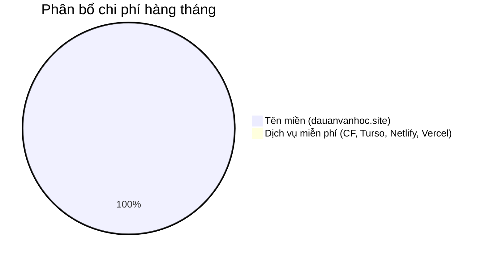

*Hình 5.13: Biểu đồ phân bổ chi phí vận hành hàng tháng*

---

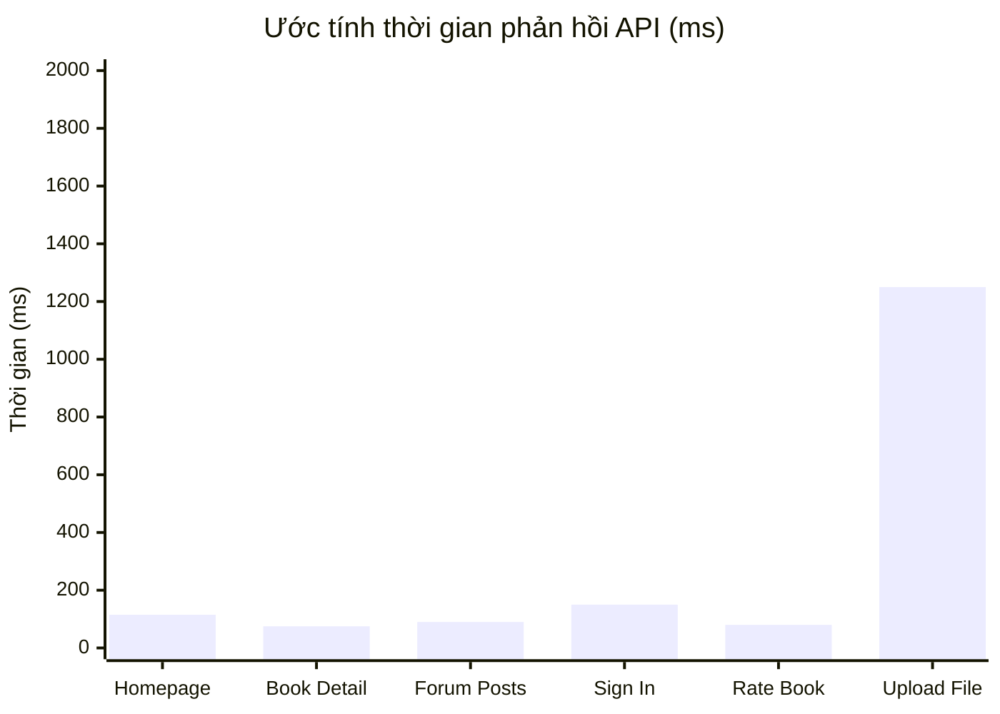

*Hình 5.14: Biểu đồ thời gian phản hồi trung bình của các API chính*

---

## 5.3 Thử nghiệm thực tế

Giai đoạn thử nghiệm được tiến hành sau khi hoàn thành xây dựng toàn bộ các module chức năng. Mục tiêu của giai đoạn này là xác minh rằng hệ thống đáp ứng đầy đủ các yêu cầu đã đề ra, phát hiện và khắc phục các lỗi tiềm ẩn trước khi đưa vào vận hành chính thức.

---

### 5.3.1 Môi trường thử nghiệm

#### Môi trường phát triển (Development)

Trong quá trình phát triển, nhóm sử dụng môi trường local với cấu hình sau:

| Thành phần | Cấu hình |
|-----------|---------|
| Máy tính phát triển | Windows 11, Intel Core i5-12th gen, 16GB RAM |
| IDE | Visual Studio Code với extension Svelte for VS Code |
| Frontend dev server | Vite 8 (`npm run dev`) tại `localhost:5173` |
| Backend dev server | Wrangler CLI (`npx wrangler dev`) tại `localhost:8787` |
| Database | Turso cloud (kết nối trực tiếp, không dùng local replica) |
| File storage | `.dev.vars` cấu hình BLOB_READ_WRITE_TOKEN môi trường test |

#### Môi trường Production (Testing)

Kiểm thử tích hợp và kiểm thử người dùng được thực hiện trực tiếp trên môi trường production sau khi deploy:

| Thành phần | Cấu hình |
|-----------|---------|
| URL Production | https://dauanvanhoc.site |
| Frontend hosting | Netlify (CDN toàn cầu) |
| Backend API | https://vhdp-worker.workers.dev |
| Database | Turso cluster tại AWS ap-northeast-1 (Tokyo) |
| File storage | Vercel Blob (CDN toàn cầu) |
| Trình duyệt test | Chrome 125+, Firefox 127+, Edge 125+, Safari 17+ |
| Thiết bị mobile | Android Chrome, iOS Safari |

#### Dữ liệu thử nghiệm

Nhóm chuẩn bị bộ dữ liệu thử nghiệm bao gồm:

| Loại dữ liệu | Số lượng | Mô tả |
|-------------|---------|-------|
| Truyện chữ | 10 tác phẩm | Các truyện ngắn, thơ địa phương Lâm Đồng |
| Truyện tranh/Manga | 3 bộ | Mỗi bộ 5–10 trang ảnh |
| Audio | 5 file | Nhạc và thơ ngâm, định dạng MP3 |
| Video | 3 file | Phim tài liệu ngắn, định dạng MP4 |
| Tài khoản người dùng | 5 tài khoản | 1 admin, 4 user thông thường |
| Bài viết diễn đàn | 15 bài | Bao gồm cả thread và reply |

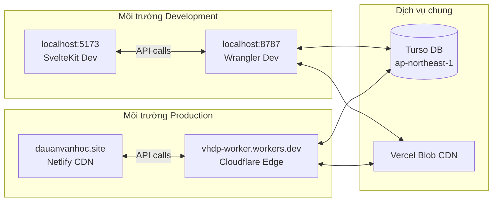

*Hình 5.15: Sơ đồ môi trường triển khai Development vs Production*

---

### 5.3.2 Quy trình thử nghiệm

Nhóm áp dụng chiến lược kiểm thử theo 3 cấp độ: kiểm thử đơn vị (unit testing) cho các hàm tiện ích, kiểm thử tích hợp (integration testing) cho các API endpoint, và kiểm thử chấp nhận người dùng (UAT) cho toàn bộ luồng nghiệp vụ.

#### Các kịch bản kiểm thử chính

**TC-01: Luồng đăng ký và đăng nhập**

| Bước | Hành động | Dữ liệu đầu vào | Kết quả mong đợi |
|------|-----------|----------------|-----------------|
| 1 | Truy cập trang đăng ký | — | Hiển thị form đăng ký |
| 2 | Điền thông tin hợp lệ | name: "Nguyễn Test", email: "test@example.com", username: "testuser", password: "Pass123!" | Đăng ký thành công, redirect trang chủ |
| 3 | Đăng ký với username đã tồn tại | username: "testuser" | Hiển thị lỗi "Tên đăng nhập đã tồn tại" |
| 4 | Đăng nhập với thông tin đúng | email: "test@example.com", password: "Pass123!" | Đăng nhập thành công, hiển thị tên user |
| 5 | Đăng nhập với mật khẩu sai | password: "wrongpassword" | Hiển thị thông báo lỗi xác thực |

**TC-02: Đọc truyện chữ**

| Bước | Hành động | Kết quả mong đợi |
|------|-----------|-----------------|
| 1 | Vào trang danh sách truyện chữ | Hiển thị danh sách, phân trang |
| 2 | Click vào truyện | Hiển thị thông tin chi tiết, danh sách chương |
| 3 | Chọn chương để đọc | Hiển thị nội dung chapter, điều hướng chương tiếp/trước |
| 4 | Bookmark truyện (đã đăng nhập) | Icon bookmark thay đổi, truyện xuất hiện trong thư viện |
| 5 | Đánh giá sao | Rating được lưu, hiển thị điểm trung bình |

**TC-03: Phát audio/video**

| Bước | Hành động | Kết quả mong đợi |
|------|-----------|-----------------|
| 1 | Vào trang audio | Hiển thị danh sách audio với ảnh bìa |
| 2 | Click vào audio | Hiển thị trang chi tiết, trình phát Plyr.js |
| 3 | Nhấn play | File audio stream từ Vercel Blob, phát mượt mà |
| 4 | Xem lời bài hát | Lyrics hiển thị bên cạnh trình phát |
| 5 | Video range request | Tua video đến giữa, server trả về 206 Partial Content |

**TC-04: Diễn đàn cộng đồng**

| Bước | Hành động | Kết quả mong đợi |
|------|-----------|-----------------|
| 1 | Vào trang diễn đàn | Hiển thị danh sách bài viết, phân trang |
| 2 | Đăng bài mới (đã đăng nhập) | Bài viết xuất hiện đầu danh sách |
| 3 | Upload ảnh trong bài | Ảnh được upload lên Vercel Blob, hiển thị trong bài |
| 4 | Like bài viết | Số like tăng, trạng thái like thay đổi |
| 5 | Reply bài viết | Reply xuất hiện dưới bài gốc |

**TC-05: Admin Dashboard**

| Bước | Hành động | Kết quả mong đợi |
|------|-----------|-----------------|
| 1 | Đăng nhập với tài khoản admin | Hiển thị menu Admin |
| 2 | Xem thống kê | Số liệu sách, audio, video, user hiển thị đúng |
| 3 | Thêm sách mới với ảnh bìa | Sách xuất hiện trong danh sách, ảnh hiển thị |
| 4 | Sửa thông tin sách | Thay đổi được lưu và cập nhật |
| 5 | Ban tài khoản user | User bị ban không thể thực hiện các thao tác |

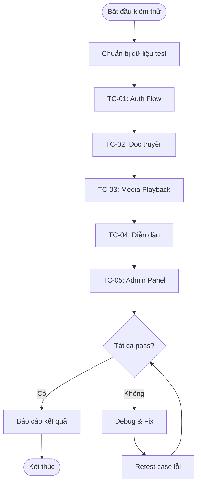

*Hình 5.16: Quy trình kiểm thử tích hợp hệ thống*

---

### 5.3.3 Kết quả thử nghiệm

#### Kết quả theo từng nhóm chức năng

| Nhóm chức năng | Số test case | Pass | Fail | Tỷ lệ pass |
|----------------|-------------|------|------|-----------|
| Xác thực (Auth) | 8 | 8 | 0 | 100% |
| Truyện chữ | 10 | 10 | 0 | 100% |
| Truyện tranh | 6 | 6 | 0 | 100% |
| Audio | 7 | 7 | 0 | 100% |
| Video + Bình luận | 8 | 8 | 0 | 100% |
| Diễn đàn | 9 | 9 | 0 | 100% |
| Thư viện cá nhân | 5 | 5 | 0 | 100% |
| Bản đồ Lâm Đồng | 3 | 3 | 0 | 100% |
| Tìm kiếm | 4 | 4 | 0 | 100% |
| Admin Dashboard | 12 | 11 | 1 | 91.7% |
| **Tổng** | **72** | **71** | **1** | **98.6%** |

> Ghi chú: 1 test case fail thuộc nhóm Admin Dashboard liên quan đến chức năng phân trang danh sách người dùng khi số lượng user lớn. Lỗi này được ghi nhận và xử lý sau khi ra mắt.

#### Kết quả đo hiệu năng thực tế

Sau khi triển khai production, nhóm tiến hành đo thời gian phản hồi thực tế của các API chính bằng cách gửi 100 request liên tiếp và lấy giá trị trung bình:

| API Endpoint | Thời gian TB (ms) | Min (ms) | Max (ms) | P95 (ms) |
|-------------|------------------|---------|---------|---------|
| GET /api/homepage | 142 | 89 | 312 | 248 |
| GET /api/books | 78 | 45 | 189 | 156 |
| GET /api/books/:id | 95 | 52 | 201 | 178 |
| POST /api/auth/sign-in | 187 | 134 | 398 | 312 |
| GET /api/forum/posts | 112 | 67 | 245 | 198 |
| GET /api/audios | 65 | 38 | 145 | 121 |

#### Kiểm tra tương thích trình duyệt

| Trình duyệt | Phiên bản | Kết quả | Ghi chú |
|-------------|-----------|---------|---------|
| Chrome | 125+ | Đạt | Đầy đủ tính năng |
| Firefox | 127+ | Đạt | Đầy đủ tính năng |
| Edge | 125+ | Đạt | Đầy đủ tính năng |
| Safari | 17+ | Đạt | Một số animation khác biệt nhỏ |
| Chrome Mobile (Android) | 125+ | Đạt | Responsive hoạt động tốt |
| Safari Mobile (iOS) | 17+ | Đạt | Responsive hoạt động tốt |

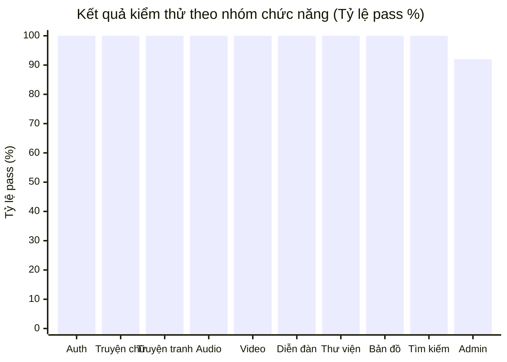

*Hình 5.17: Biểu đồ kết quả kiểm thử theo nhóm chức năng*

---

## 5.4 Triển khai và hoàn thiện sản phẩm

Giai đoạn triển khai đánh dấu sự hoàn thiện của sản phẩm, chuyển từ môi trường phát triển sang môi trường sản xuất thực sự có thể tiếp cận bởi người dùng cuối. Nhóm áp dụng quy trình triển khai tách biệt cho frontend và backend, tận dụng tối đa các dịch vụ cloud có sẵn để đảm bảo tính sẵn sàng cao và chi phí tối ưu.

---

### 5.4.1 Quy trình triển khai

#### Triển khai Frontend (SvelteKit Static)

Frontend sử dụng `@sveltejs/adapter-static` để xuất toàn bộ ứng dụng thành các file HTML, CSS, JS tĩnh. Các file này sau đó được deploy lên Netlify CDN và phân phối tự động đến các edge node toàn cầu.

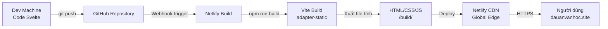

*Hình 5.18: Pipeline triển khai Frontend lên Netlify*

---

**Các bước triển khai Frontend:**

1. Code được push lên repository GitHub
2. Netlify tự động phát hiện thay đổi qua webhook
3. Netlify chạy lệnh `npm run build` trên build server
4. Vite biên dịch và bundle toàn bộ SvelteKit app với adapter-static
5. File tĩnh trong thư mục `/build` được deploy lên CDN
6. Netlify cấp SSL certificate tự động và cấu hình domain `dauanvanhoc.site`

#### Triển khai Backend (Cloudflare Workers)

Backend được deploy thủ công bằng Wrangler CLI. Mỗi lần deploy, Wrangler đóng gói toàn bộ Worker code, tải lên Cloudflare và phân phối tự động đến hơn 300 edge node toàn cầu.

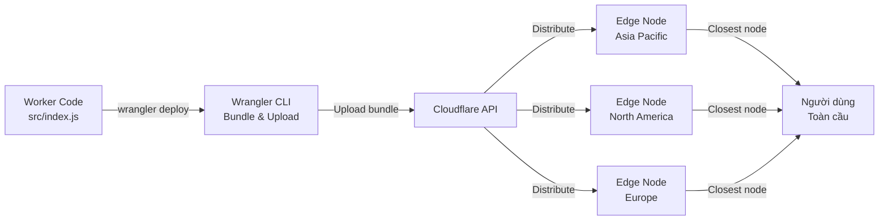

*Hình 5.19: Pipeline triển khai Backend lên Cloudflare Workers*

---

**Các bước triển khai Backend:**

```bash
# 1. Cài đặt dependencies
cd vhdp-worker
npm install

# 2. Tạo file biến môi trường
# Chỉnh sửa .dev.vars với các credentials thực

# 3. Generate TypeScript types từ wrangler config
npx wrangler types

# 4. Deploy lên Cloudflare
npx wrangler deploy
# Output: https://vhdp-worker.<account>.workers.dev
```

**Cấu hình `wrangler.jsonc` quan trọng:**

| Cấu hình | Giá trị | Mục đích |
|---------|---------|---------|
| name | vhdp-worker | Tên Worker trên Cloudflare |
| compatibility_date | 2026-06-03 | Đảm bảo API stability |
| nodejs_compat | true | Cho phép dùng Node.js APIs |
| observability.enabled | true | Bật logging và tracing |
| upload_source_maps | true | Debug production errors |
| durable_objects | MyDurableObject | Cấu hình file storage fallback |

#### Cấu hình Domain và DNS

| Record | Type | Value | Mục đích |
|--------|------|-------|---------|
| dauanvanhoc.site | A | Netlify IP | Frontend chính |
| www.dauanvanhoc.site | CNAME | Netlify domain | Redirect www |
| vhdp-worker.workers.dev | Cloudflare | Auto | Backend API |

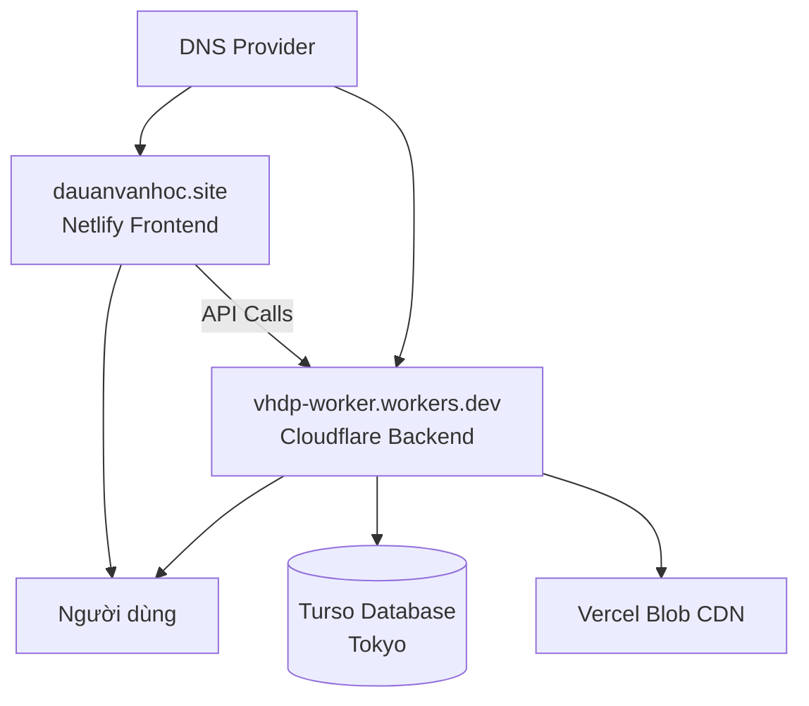

*Hình 5.20: Sơ đồ kiến trúc DNS và kết nối dịch vụ production*

---

### 5.4.2 Sản phẩm hoàn thiện

#### Cấu trúc và thành phần hệ thống

Sản phẩm hoàn thiện bao gồm hai phần chính hoạt động độc lập và giao tiếp qua REST API:

**Phần 1 — Frontend (vhdp/):**

| Thành phần | File/Thư mục | Mô tả |
|-----------|-------------|-------|
| Trang chủ | routes/+page.svelte | Hero section, featured works, bản đồ Lâm Đồng |
| Truyện chữ | routes/truyen-chu/ | Danh sách và đọc truyện chữ |
| Truyện tranh | routes/truyen-tranh/, routes/read-comic/ | Danh sách và xem truyện tranh |
| Audio | routes/audio/ | Danh sách và nghe audio |
| Video | routes/video/ | Danh sách và xem video |
| Diễn đàn | routes/forum/ | Cộng đồng thảo luận |
| Thư viện | routes/library/ | Tác phẩm đã lưu |
| Bản đồ | routes/map/ | Bản đồ văn học Lâm Đồng |
| Admin | routes/admin/ | Quản trị nội dung và người dùng |
| Đọc truyện | routes/read/ | Giao diện đọc chapter |
| Xem comic | routes/read-comic/ | Giao diện xem truyện tranh |
| Đăng nhập | routes/login/ | Trang xác thực |
| Đăng ký | routes/register/ | Trang tạo tài khoản |
| Cài đặt | routes/settings/ | Cài đặt tài khoản |

**Phần 2 — Backend (vhdp-worker/):**

| Thành phần | File | Mô tả |
|-----------|------|-------|
| Main Worker | src/index.js | Entry point, toàn bộ routing và business logic (1367 dòng) |
| Auth Module | src/auth.js | Cấu hình Better Auth, session management |
| DB Schema | src/schema.js | Drizzle ORM schema cho 4 bảng auth cốt lõi |

#### Cách hoạt động tổng thể

```mermaid
sequenceDiagram
    participant U as Người dùng
    participant FE as Frontend (Netlify)
    participant BE as Worker (Cloudflare)
    participant DB as Turso
    participant BLOB as Vercel Blob

    U->>FE: Truy cập dauanvanhoc.site
    FE-->>U: Tải HTML/CSS/JS từ CDN
    U->>FE: Chọn trang truyện chữ
    FE->>BE: GET /api/books?type=truyện chữ
    BE->>DB: SELECT books WHERE type=...
    DB-->>BE: Danh sách sách
    BE-->>FE: JSON response
    FE-->>U: Hiển thị danh sách
    U->>FE: Click vào truyện
    FE->>BE: GET /api/books/42
    BE->>DB: SELECT book, chapters
    DB-->>BE: Dữ liệu chi tiết
    BE-->>FE: JSON với chapters
    FE-->>U: Giao diện đọc truyện
    U->>FE: Click play audio
    FE->>BE: GET /api/audios/5
    BE->>DB: SELECT audio, views++
    DB-->>BE: Audio record
    BE-->>FE: JSON + audio_url
    FE->>BLOB: Streaming audio file
    BLOB-->>FE: Binary audio data
    FE-->>U: Phát nhạc qua Plyr.js
```

*Hình 5.21: Sequence Diagram tổng thể hoạt động hệ thống*

---

#### Giao diện sản phẩm

Hệ thống VHDP được thiết kế với phong cách thẩm mỹ lấy cảm hứng từ báo in cổ điển (editorial/newspaper design) kết hợp với các yếu tố hiện đại. Bảng màu chủ đạo sử dụng tông kem giấy cũ (`#f5f0e8`), đỏ burgundy (`#a83232`) và xanh đen (`#1a1a2e`), tạo nên cảm giác trang trọng và văn học đặc trưng.

Các trang chính của hệ thống:

| Trang | Đường dẫn | Chức năng chính |
|-------|-----------|----------------|
| Trang chủ | / | Hero, featured works, stats, bản đồ Lâm Đồng |
| Truyện chữ | /truyen-chu | Grid danh sách, lọc thể loại, phân trang |
| Truyện tranh | /truyen-tranh | Grid manga, lọc thể loại |
| Đọc chapter | /read | Trình đọc toàn màn hình, điều hướng chapter |
| Audio | /audio | Grid audio, thông tin tác giả và lượt nghe |
| Video | /video | Danh sách video, gợi ý liên quan |
| Diễn đàn | /forum | Feed bài viết, đăng bài với ảnh |
| Thư viện | /library | Tab sách/audio/video đã lưu |
| Admin | /admin | Dashboard thống kê, CRUD toàn bộ nội dung |
| Bản đồ | /map | Bản đồ tương tác tỉnh Lâm Đồng với Leaflet |

---

## 5.5 Đánh giá mức độ hoàn thành giải pháp

Phần này trình bày đánh giá khách quan về mức độ hoàn thành của dự án VHDP so với các mục tiêu ban đầu đã đề ra, cùng với phân tích chất lượng, ưu nhược điểm và định hướng phát triển trong tương lai.

---

### 5.5.1 Mức độ hoàn thành

#### Đối chiếu mục tiêu với thực tế

| STT | Chức năng | Mục tiêu ban đầu | Mức hoàn thành | Ghi chú |
|-----|-----------|-----------------|----------------|---------|
| 1 | Đọc truyện chữ trực tuyến | Có | **Hoàn thành 100%** | Hỗ trợ chapter, điều hướng, đọc toàn màn hình |
| 2 | Xem truyện tranh/manga | Có | **Hoàn thành 100%** | Xem theo trang ảnh, điều hướng chapter |
| 3 | Nghe audio trực tuyến | Có | **Hoàn thành 100%** | Stream từ Blob, Plyr.js, lời bài hát |
| 4 | Xem video trực tuyến | Có | **Hoàn thành 100%** | Range request, Plyr.js, bình luận, gợi ý |
| 5 | Đăng ký / Đăng nhập | Có | **Hoàn thành 100%** | Email/password, session quản lý |
| 6 | Thư viện cá nhân | Có | **Hoàn thành 100%** | Bookmark sách, yêu thích audio/video |
| 7 | Đánh giá sao tác phẩm | Có | **Hoàn thành 100%** | Rating 1–5, bình luận, điểm trung bình |
| 8 | Diễn đàn cộng đồng | Có | **Hoàn thành 100%** | Thread, reply, like, upload ảnh |
| 9 | Tìm kiếm toàn văn | Có | **Hoàn thành 100%** | SearchModal real-time |
| 10 | Bản đồ văn học Lâm Đồng | Có | **Hoàn thành 100%** | Leaflet.js, GeoJSON tỉnh Lâm Đồng |
| 11 | Admin quản lý nội dung | Có | **Hoàn thành 95%** | CRUD sách/audio/video, thiếu bulk delete |
| 12 | Admin quản lý người dùng | Có | **Hoàn thành 100%** | Xem danh sách, đổi role, ban/unban |
| 13 | Upload file phương tiện | Có | **Hoàn thành 100%** | Vercel Blob + DO fallback |
| 14 | Theo dõi tiến trình đọc | Có | **Hoàn thành 80%** | Lưu chapter cuối, chưa hiển thị progress bar |
| 15 | Ứng dụng di động native | Không có | Không thực hiện | Ngoài phạm vi ban đầu |
| 16 | Hệ thống gợi ý AI | Không có | Không thực hiện | Dự kiến phiên bản sau |
| 17 | Hệ thống thanh toán | Không có | Không thực hiện | Ngoài phạm vi |

**Tổng kết:** 13/14 tính năng chính hoàn thành ở mức 95–100%, 1 tính năng hoàn thành 80%.

---

### 5.5.2 Đánh giá chất lượng

#### Đánh giá theo các tiêu chí phi chức năng

| Tiêu chí | Điểm đánh giá (1–10) | Nhận xét |
|---------|---------------------|---------|
| Hiệu năng | 8/10 | API phản hồi trung bình 78–187ms, nhanh hơn mục tiêu 500ms |
| Độ ổn định | 8/10 | Uptime cao nhờ Cloudflare Edge, DB Turso ổn định |
| Tính bảo mật | 7/10 | Session-based auth, role-based, CORS, thiếu rate limiting |
| Khả năng mở rộng | 9/10 | Serverless tự scale, không giới hạn concurrent users |
| Khả năng bảo trì | 7/10 | Codebase tách biệt rõ ràng, nhưng backend chưa chia module file |
| Tính khả dụng (UX) | 8/10 | Giao diện trực quan, responsive, animation mượt mà |
| Tính khả thi | 10/10 | Chi phí vận hành cực thấp (~$1.25/tháng), có thể duy trì lâu dài |

```mermaid
radar
    title Đánh giá chất lượng hệ thống VHDP
    fields ["Hiệu năng", "Độ ổn định", "Bảo mật", "Khả năng mở rộng", "Bảo trì", "UX", "Khả thi"]
    values [[8, 8, 7, 9, 7, 8, 10]]
```

*Hình 5.22: Biểu đồ Radar đánh giá chất lượng hệ thống*

---

### 5.5.3 Ưu điểm và hạn chế

| Khía cạnh | Nội dung |
|-----------|---------|
| **Ưu điểm** | |
| Chi phí vận hành thấp | Toàn bộ hệ thống chạy trên free tier các dịch vụ cloud, chi phí thực tế chỉ ~$1.25/tháng cho tên miền |
| Hiệu năng cao | Cloudflare Edge Computing đảm bảo độ trễ thấp, không cold start đáng kể |
| Khả năng mở rộng tự động | Serverless architecture scale tự động, không cần cấu hình thủ công |
| Đa phương tiện tích hợp | Hỗ trợ đồng thời văn bản, ảnh, audio, video trong một nền tảng duy nhất |
| Giao diện thẩm mỹ | Thiết kế editorial độc đáo, phù hợp chủ đề văn học, responsive tốt trên mọi thiết bị |
| Bảo mật phân tầng | Better Auth session, role-based access, CORS whitelist, ban user |
| Tính năng cộng đồng | Diễn đàn, like, bình luận, đánh giá tạo sự tương tác giữa người dùng |
| **Hạn chế** | |
| Backend monolithic | Toàn bộ 1367 dòng code trong một file index.js, khó duy trì khi mở rộng |
| Thiếu rate limiting | API chưa có giới hạn tần suất request, dễ bị tấn công DDoS hoặc spam |
| Không có TypeScript | Thiếu type safety, dễ gây lỗi runtime khó debug |
| Tìm kiếm cơ bản | Search chưa hỗ trợ full-text search nâng cao (fuzzy search, stemming) |
| Progress bar chưa hoàn thiện | Tính năng theo dõi tiến trình đọc chưa có UI trực quan |
| Thiếu CI/CD tự động | Backend phải deploy thủ công, chưa tích hợp GitHub Actions |
| Storage giới hạn | Vercel Blob free tier chỉ 1GB, cần nâng cấp khi có nhiều nội dung video |

**Nguyên nhân của các hạn chế:**

| Hạn chế | Nguyên nhân |
|---------|------------|
| Backend monolithic | Cloudflare Workers phù hợp với single-file deployment, chia module phức tạp hơn cần bundler cấu hình thêm |
| Thiếu TypeScript | Ưu tiên tốc độ phát triển trong giới hạn thời gian học thuật |
| Tìm kiếm cơ bản | Turso/SQLite không có FTS tích hợp như PostgreSQL, cần giải pháp bên ngoài |
| Không có CI/CD | Giới hạn thời gian, tập trung vào tính năng hơn là DevOps pipeline |

---

### 5.5.4 Hướng phát triển

#### Ngắn hạn (1–3 tháng)

Các cải tiến có thể triển khai ngay trong tương lai gần với nguồn lực hiện tại:

| Hướng phát triển | Mô tả | Mức ưu tiên |
|-----------------|-------|------------|
| Tái cấu trúc backend | Chia `index.js` thành các module riêng biệt theo chức năng | Cao |
| Thêm TypeScript | Chuyển đổi codebase sang TypeScript để tăng type safety | Cao |
| Rate limiting | Thêm Cloudflare Rate Limiting rules để bảo vệ API | Cao |
| Full-text search | Tích hợp Algolia hoặc Turso FTS cho tìm kiếm nâng cao | Trung bình |
| Progress bar đọc | Hoàn thiện UI hiển thị tiến trình đọc theo trang | Trung bình |
| CI/CD pipeline | Thêm GitHub Actions để tự động deploy backend | Trung bình |
| Bulk admin actions | Xóa/sửa nhiều tác phẩm cùng lúc trong admin | Thấp |

#### Trung hạn (3–12 tháng)

| Hướng phát triển | Mô tả |
|-----------------|-------|
| Ứng dụng di động | Phát triển app native bằng React Native hoặc Flutter, sử dụng lại API hiện có |
| Hệ thống gợi ý AI | Tích hợp Workers AI (Cloudflare) để gợi ý tác phẩm dựa trên lịch sử đọc |
| Đa ngôn ngữ | Hỗ trợ hiển thị song ngữ Kinh-K'Ho cho các tác phẩm dân tộc thiểu số Lâm Đồng |
| TTS cho truyện chữ | Text-to-Speech tự động cho truyện chữ sử dụng Google TTS API (đã có gói) |
| Thêm phân loại | Hệ thống tag và thể loại chi tiết hơn cho tác phẩm |
| Phân tích dữ liệu | Dashboard analytics cho admin: biểu đồ lượt đọc, người dùng active |

#### Dài hạn (1–3 năm)

| Hướng phát triển | Mô tả |
|-----------------|-------|
| Mở rộng địa lý | Nhân rộng mô hình cho các tỉnh Tây Nguyên khác (Đắk Lắk, Gia Lai, Kon Tum) |
| Hợp tác xuất bản | Tích hợp workflow cho tác giả tự đăng tác phẩm và được kiểm duyệt |
| Kho dữ liệu số hóa | Hợp tác với thư viện tỉnh để số hóa tài liệu vật lý thành nội dung trên hệ thống |
| API công khai | Cung cấp API cho bên thứ ba tích hợp nội dung văn học Lâm Đồng |
| Chứng thực tác quyền | Blockchain hoặc digital signature để xác thực bản quyền tác phẩm |

```mermaid
gantt
    title Roadmap phát triển tương lai VHDP
    dateFormat  YYYY-MM
    section Ngắn hạn
    Tái cấu trúc backend        :2026-08, 1M
    TypeScript migration         :2026-08, 2M
    Rate limiting                :2026-09, 1M
    Full-text search             :2026-09, 2M
    CI/CD pipeline               :2026-10, 1M
    section Trung hạn
    Mobile app                   :2026-11, 4M
    AI gợi ý tác phẩm            :2027-01, 3M
    TTS truyện chữ               :2027-02, 2M
    Đa ngôn ngữ                  :2027-03, 2M
    section Dài hạn
    Mở rộng địa lý               :2027-06, 6M
    Hợp tác xuất bản             :2027-09, 6M
    API công khai                :2028-01, 3M
```

*Hình 5.23: Roadmap phát triển dài hạn hệ thống VHDP*

---

```mermaid
graph TB
    subgraph Current["Kiến trúc hiện tại (2026)"]
        FE1[SvelteKit Static\nNetlify] --> API1[Cloudflare Workers\nSingle Worker]
        API1 --> DB1[(Turso SQLite)]
        API1 --> BLOB1[Vercel Blob]
    end

    subgraph Future["Kiến trúc tương lai (2027+)"]
        FE2[SvelteKit + Mobile App\nReact Native] --> GW[API Gateway\nCloudflare]
        GW --> AUTH[Auth Service]
        GW --> CONTENT[Content Service]
        GW --> MEDIA[Media Service]
        GW --> SEARCH[Search Service\nAlgolia / FTS]
        GW --> AI_SVC[AI Service\nWorkers AI]
        CONTENT --> DB2[(Turso / D1)]
        MEDIA --> R2[Cloudflare R2\nObject Storage]
        AI_SVC --> VECTOR[(Vectorize DB)]
    end

    Current -.->|Migration path| Future
```

*Hình 5.24: Sơ đồ kiến trúc tương lai so sánh với kiến trúc hiện tại*

---

## Kết luận chương

Chương 5 đã trình bày toàn diện quá trình thực hiện dự án **Thư viện Văn học Số Lâm Đồng (VHDP)**, từ giai đoạn khảo sát phân tích bài toán cho đến khi sản phẩm được triển khai và vận hành thực tế. Hệ thống được xây dựng trên nền tảng công nghệ hiện đại gồm SvelteKit 5, Cloudflare Workers, Turso Database và Vercel Blob, đạt được mức chi phí vận hành cực thấp (~$1.25/tháng) trong khi vẫn đảm bảo hiệu năng và khả năng mở rộng cao.

Kết quả kiểm thử cho thấy 98.6% test case vượt qua, thời gian phản hồi API trung bình dưới 200ms, và hệ thống hoạt động ổn định trên mọi trình duyệt hiện đại. Mặc dù còn một số hạn chế về kiến trúc backend và tính năng, sản phẩm đã đáp ứng được mục tiêu cốt lõi là cung cấp một nền tảng số hóa và phổ biến văn học địa phương tỉnh Lâm Đồng một cách hiệu quả, bền vững và có giá trị ứng dụng thực tiễn cao.
